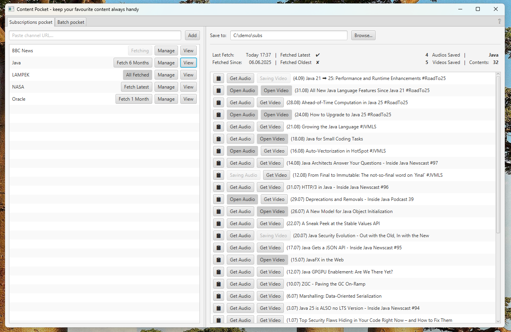
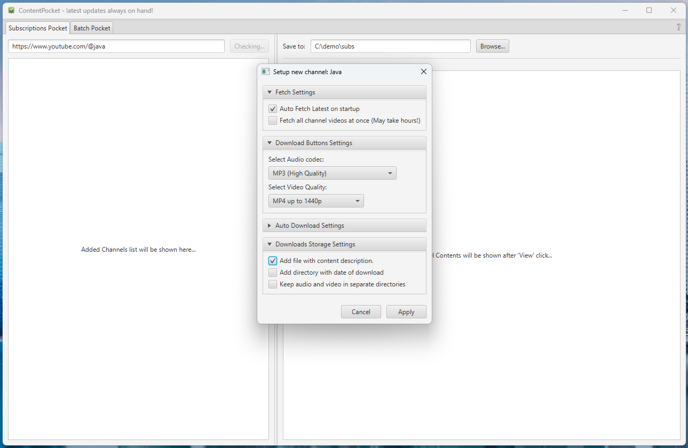
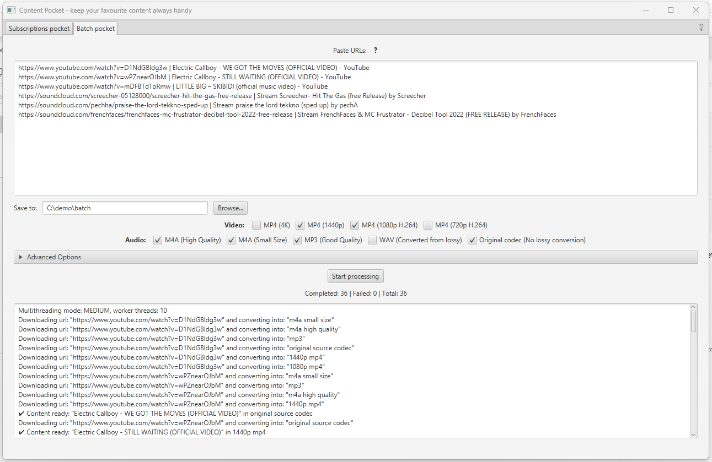
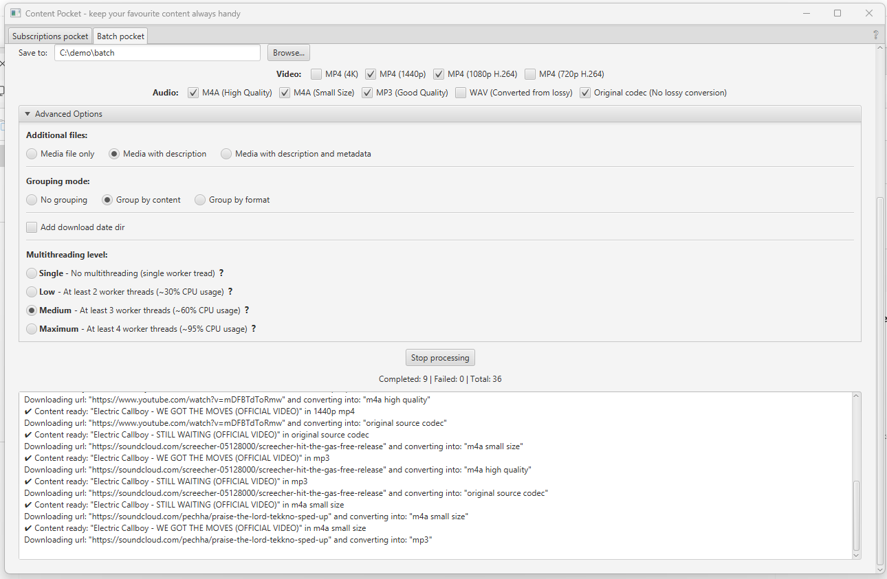

#  ContentPocket 
[](LICENSE)

No clickbaits. No feeds. No shorts. No distractions.

ContentPocket is a cross-platform Java desktop application designed for checking and watching latest content with chosen format in distraction-free mode.

**Subscriptions tab:** Add your trusted channels or content providers, fetch titles progressively from latest and decide what to play as audio, video, or both (with per-channel format and quality preferences).

**Batch tab:** Reach your meaningful or favourite content in a format you need. Paste links, choose fitting formats, group them flexibly and control your system load with adjustable multithreading.

This is a PET (Personal Educational/Training) project, created for learning and experimentation.
It is not intended for commercial use or production deployment.

---

## 📸 UI preview (screenshots)

### Subscriptions Tab
- **Browse & Manage Filtered Content**  
  Add channels, fetch latest, browse content, play videos or audios. Only sources you trust, no distractors.  
  

- **Per-channel Settings**  
  Configure default formats, additional files, and auto-fetch latest on startup or progressively on demand.  
  

### Batch Tab
- **Main view**  
  Paste multiple video or audio links (works with multiple providers), select required formats, and reach what you need.  
  

- **Advanced options**  
  Customize file modes, grouping rules, and multithreading levels for efficient stream handling.  
  
- 
---

## 📥 Installation

### 🪟 Windows - "Plug & Play" - Portable ZIP (tools bundled)
This distribution already includes the required executables (`ffmpeg`, `ffprobe`, `yt-dlp`).  
No setup needed:

1. Download the ZIP.
2. Extract files.
3. Run `ContentPocket.exe`.

That’s all.

---

### 🪟 Windows - Lightweight ZIP (tools not bundled)
If you already have `ffmpeg`, `ffprobe`, and `yt-dlp` installed (either in a folder or on your system/user PATH), you can use lightweight (without tools execs inside) distribution.

1. Download the ZIP.
2. Extract files.
3. Run `ContentPocket.exe`.

The app will:
- First check whether required binaries are available via `PATH`.
- If not found, App will ask you to provide a directory with tools execs.

**Requirement:** all tools executables must be placed in the same directory.

That's all.

---

### 🍏 macOS - DMG image (tools not bundled)
As Apple Inc. does not try to make developer's life easier (unless you pay 100$/y),
required tools binaries could not be easily bundled, and installing this App on macOS needs some more hustle.

1. Install `ffmpeg`, `ffprobe`, and `yt-dlp_macos`.

The app will look for them:
- On your user/system `PATH`.
- In `~/bin/`.
- If not found, App will ask you to provide a directory with tools binaries.

**Requirement:** all tools must be placed in the same directory.

2. Make sure the binaries have required permissions:
   ```bash
   chmod 755 ffmpeg ffprobe yt-dlp_macos
   ```
- Or setup more restrictive custom permissions with at least: `yt-dlp_macos`: rwx, `ffmpeg`: rwx, `ffprobe`: rx

3. Allow the app from 'Unknown Developer' in macOS Security & Privacy settings:
   [Apple Support Guide](https://support.apple.com/guide/mac-help/mh40616/mac)


4. If App still have problem  still fails, run the app from Terminal:
   ```bash
   /Applications/ContentPocket.app/Contents/MacOS/ContentPocket
   ```

Good luck.

---

## ☕ Codebase Overview

ContentPocket consists of **5 highly independent, decoupled modules**.  
The project is written in pure Java & JavaFX, with no external frameworks. 
Uses Jackson for json files storage, and compile time, static Lombok dependencies.     

---

### 📖 Commands-API (standalone library)

This module acts as a **pure Java library** for building yt-dlp + ffmpeg processes.  
In the future it may be published as a standalone repository.

- **Exports APIs**
    - `ProcessFactory` — abstraction for building ready-to-run processes:
        - Reach audio-only stream
        - Reach audio+video stream
        - Fetch channel data or content list with selected output params
    - `CmdBuilder` — abstraction for building structured multi-parameter commands, easy to extend for custom `ProcessFactory` implementations.

- **Exports settings**
    - `DownloadOption`
        - `AudioOption` → used in `ProcessFactory.audioStream()`
            - Default impl: `AudioOnlyQuality` with MP3, high-bitrate M4A, low-size M4A, WAV (converted from lossy), and *source codec* (best available without lossy conversion).
        - `VideoOption` → used in `ProcessFactory.videoWithAudioStream()`
            - Default impl: `VideoQuality` with 720p → 4K MP4 resolutions, H.264 + AAC enforced at 720p/1080p, flexible at higher resolutions with fallbacks.
    - `StorageOptions` — defines grouping modes, content description, `info.json` inclusion, today's date, etc.
    - `DlpCmd` — interface with `FetchCmd` & `DownloadCmd` implementations, bundling useful yt-dlp command sets.

- **ProcessFactory usage**
    - Requires paths to `yt-dlp` and `ffmpeg` executables.
    - Accepts a text output file (stable UTF-8 platform-independent results).
    - Parameters: chosen download options + storage options.

- **Current heuristics**
    - Implements sensible fallbacks for stream codec selection.
    - Optimizes ffmpeg post-processing when needed.

- **Future extensions**
    - Fetch full codec lists and auto-select best target codec.
    - Conditional post-processing via ffprobe checks.

---

### 📦 Batch Module (pluggable tab)

- Requires: `commands-api`, `common`.
- Provides: `BatchTabPlugin` (via pluggable `TabPlugin` SPI).
- Opens: JavaFX UI elements and controllers.

**Functionality**
- Paste hundreds of content URLs.
- Reach streams with selected options, and formats.
- Grouping modes:
    - *By Content* → all formats of a content grouped together.
    - *By Format* → all contents in given codec/format grouped together.
- Adjustable multithreading level, backed by a platform thread pool.
- Custom queue + dispatcher:
    - Graceful stop (finish current tasks, abort pending).
    - Force stop (immediate shutdown).

---

### 📺 Subscriptions Module (pluggable tab)

- Requires: `commands-api`, `common`.
- Provides: `SubscriptionsTabPlugin` (via pluggable `TabPlugin` SPI).
- Opens: JavaFX UI elements and controllers.
- Stores: subscription data in JSON files (no DB, keeps app lightweight).

**Functionality**
- Manage content publishers (channels).
- Fetch published contents progressively (from latest backwards).
- Per-channel settings:
    - Auto-fetch latest on startup.
    - Default audio/video format settings.
- For each content:
    - **Get Audio** / **Get Video** buttons → reach with preconfigured settings.
    - **Open** → opens ready stream in explorer.
- Uses a **Virtual-Per-Task Executor**:
    - Lightweight async fetches & stream handling.
    - Smooth UI responsiveness.

---

### 🔗 Main Module (application entry point)

- Requires: `common`.
- Uses: `TabPlugin` SPI to load Batch, Subscriptions, or any other pluggable tab module.
- Requires: `yt-dlp` and `ffmpeg` executables.
    - Bundled with Windows ZIP distribution.
    - macOS users must install manually.

**Functionality**
- Provides the main application window.
- On startup:
    - Verifies whether executables are available at default locations.
    - If not, prompts the user to specify installation path.

*All real logic is in the `common` module — `main` is primarily startup, validation + SPI loader.*

---

### ⚙️ Common Module (application core)

- Requires: `commands-api`.
- Exports APIs required by both main and tab modules:
    - `BinariesManager` — discovers and validates yt-dlp/ffmpeg binaries.
    - `TabPlugin` SPI — defines pluggable feature tabs.

**Role**
- Central application logic lives here.
- Shared utilities and abstractions for Batch/Subscriptions modules.
- Acts as the “core” runtime layer.

---

## 🏛️ License
This project is licensed under the [MIT License](LICENSE).

You are free to use, modify, and distribute this software.  
If you do, please include the original copyright notice and mention me as the author.

Please ensure your use of this software complies with the terms of service of the content platforms you interact with, as well as with applicable laws in your jurisdiction.
The author does not take responsibility for how the software is used.

---

## 🔖 Third-party software

This application bundles prebuilt binaries of:

- [FFmpeg 7.1.1](https://ffmpeg.org/) and [FFprobe 7.1.1](https://ffmpeg.org/)  
  Licensed under the GNU GPL v3 (see `/licenses/GPL-3.0.txt` and `/licenses/LICENSE-FFmpeg.md`).

- [yt-dlp 2025.06.09](https://github.com/yt-dlp/yt-dlp)  
  Licensed under the Unlicense (see `/licenses/UNLICENSE.txt`).

On Windows release, these executables are bundled unmodified in `/tools`.  
On macOS release, the user must install them manually (tested with versions: FFmpeg 7.1.1, yt-dlp 2025.06.09).

---

## 🔄 Contributing and Troubleshooting

Feel free to open an issue if you spot a problem or have a suggestion for improvement.

Before raising a pull request, please check if I am currently active/responsive on GitHub or LinkedIn.

If you encounter common problems (e.g. macOS Gatekeeper warnings, missing `yt-dlp`/`ffmpeg`), please check the **Installation** section first — most setup issues are covered there.

---